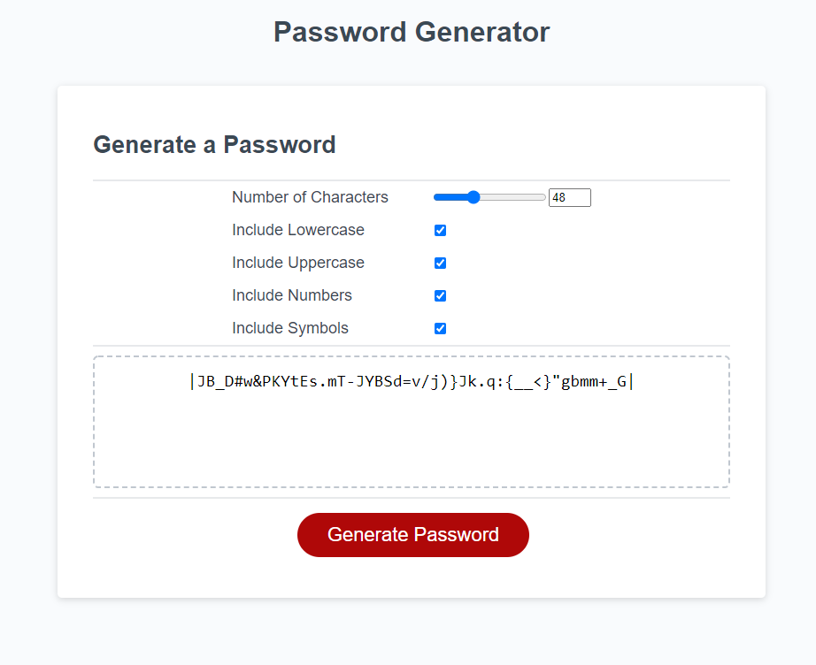

## Description:
    This is a password generator to create strong and secure passwords that also meet a certain criteria.

## HTML: 
    Added extra divs to allow for the password options to be presented to the user in a clean manner before creating the password.

## CSS:
    Added a bit of formatting to the new selectable options for the user.

## JS:
    Made sure to allow for different options to allow password to meet different criterias and completely randomize it.

## Link: 
    https://jfig27.github.io/Password-Generator/index.html

## Screenshot: 
